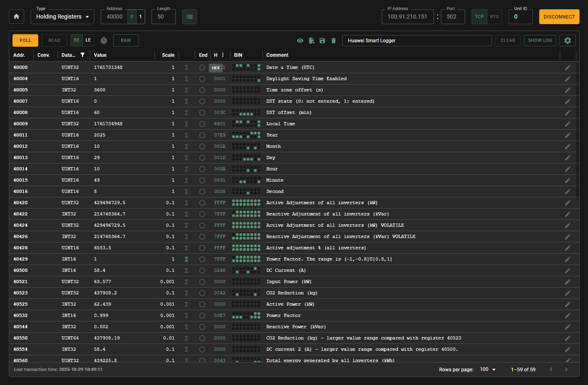

# Modbux

> by [ploxc](https://github.com/ploxc)


## A Modbus Client & Server Simulation Tool

**Modbux is the tool I desperately needed four years ago.** It handles both Modbus TCP and RTU, lets you assign datatypes to registers, scan for addresses and data, simulate servers for testing, and actually _understand_ what you're reading, all in one app.

## Download

**[Download the latest release](https://github.com/ploxc/modbux/releases/latest)**

Available for Windows and macOS

**[Read the documentation](https://github.com/ploxc/modbux/wiki)**

## Features

**Client Mode:**

- Read/write with 11 data types (int16/32/64, uint16/32/64, float, double, timestamps, UTF-8 strings)
- Advanced mode: see all numeric data type interpretations simultaneously
- Read Configuration mode: efficiently read only configured registers with automatic grouping
- Scan Unit IDs and register ranges
- Big-endian / Little-endian support (swap registers)
- Scaling factors and linear interpolation
- Modbus TCP and RTU support for client
- Configuration save/load (JSON)

**Server Mode:**

- Simulate up to 10 Modbus devices
- 248 Unit IDs per server (0-247)
- Static or random value generation
- Instant auto-start for testing

**Split Mode:**

- Run client and server side-by-side in separate windows
- Test against your own simulations locally

**State Persistence:**

- Everything saves automatically between sessions

## UI



## Why This Exists

Four years ago, I was thrown into a CHP plant commissioning with zero Modbus experience. The client didn't know the addresses. I didn't know the protocol. I had a scanner that found... something... and a hex reader that showed me values I couldn't interpret.

_Is that temperature in register 100 or 101? Does the documentation start at 0 or 1? Why does TIA Portal call it 40000 when the manual says holding register 0? Is it big-endian or little-endian? Input registers or holding registers? Which function code do I even need?_

Oh, and it was Modbus RTU, so add "are my termination resistors right?" and "is my wiring actually correct?" to the list. Because if those aren't perfect, you're reading absolutely nothing and troubleshooting blind.

**This went on for four years.**

Gradually, I figured it out. But I watched colleague after colleague hit the same walls. We'd eventually succeed, sure, with blood, sweat, and way too many site visits. The tools we had could read a float or an int if you were lucky, but they never gave you the full picture. Endianness? Swap the registers yourself and hope. Documentation starting at the wrong offset? Good luck finding where the data actually lives.

Modbus TCP helped, at least the physical layer wasn't fighting you anymore. I built a TypeScript implementation for my home solar panels using [modbus-serial](https://www.npmjs.com/package/modbus-serial) (thanks [yaacov](https://github.com/yaacov)!), and things started clicking. The protocol itself actually made sense once you understood it.

Then came another commissioning. More problems. More frustration. And I snapped.

**"I've had enough of this."**

I dove into the protocol properly, really _understood_ it, and realized: I already have the pieces. I know how this works now. I can build the tool I've been wishing existed this entire time.

So I did.

I built something that shows you every possible data interpretation at once. That scans not just for devices, but for _where the actual data is_ (because I once spent hours discovering third-party documentation had the wrong register range). That lets you test PLC implementations against simulated devices _before_ you're on-site hoping everything works.

I use it every single day now. The idea of writing Modbus code and just _hoping_ it works when I connect to the real device? That's not how I work anymore.

**If you've ever fought with Modbus, you'll understand why this needed to exist.**

Built with Electron, React, and Material-UI. Open source because this industry needs better tools.

## Why "Modbux"?

It's a typo I always made, _modbux_ instead of _modbus_. But it fits: it's your user experience (UX) working with Modbus. The typo became the brand.

## Pro Tip: Let AI Do the Boring Stuff

Saved configs are JSON. Show Claude or ChatGPT a few example registers, paste your device documentation, ask it to complete the mapping. Load it back into Modbux, done. Welcome to 2025.

## Installation

### Windows

Download the `.exe` file from releases.

⚠️ **SmartScreen warning**: Click "More info" → "Run anyway"

### macOS

Download the `.dmg` file from releases.

⚠️ **First time opening**: Right-click the app and select "Open"
(or go to System Preferences → Security & Privacy → "Open Anyway")

## Build It Yourself

Modbux is an Electron application built with React, TypeScript, and Material-UI.

### Prerequisites

- Node.js (LTS version recommended)
- Yarn package manager

### Setup

**Clone and install dependencies:**

```bash
git clone https://github.com/ploxc/modbux.git
cd modbux
yarn
```

### Development

**Run the app in development mode:**

```bash
yarn dev
```

### Build

**Create a distributable package for your platform:**

```bash
# For Windows
yarn build:win

# For macOS
yarn build:mac

# For Linux
yarn build:linux
```

## Contributing

Found a bug? Have a feature request? **Please open an issue!** Modbux was born from real-world frustrations, and your feedback helps make it better for everyone in the industry.

Feel free to contribute—whether it's reporting issues, suggesting features, or submitting pull requests. Let's build the Modbus tool we all wish we'd had from day one.

## License

This project is licensed under the MIT License - see the [LICENSE](LICENSE) file for details.

## Third-Party Software

This software uses open-source packages with permissive licenses (MIT, ISC, Apache-2.0, BSD).
All third-party licenses are included in the distributed application.
