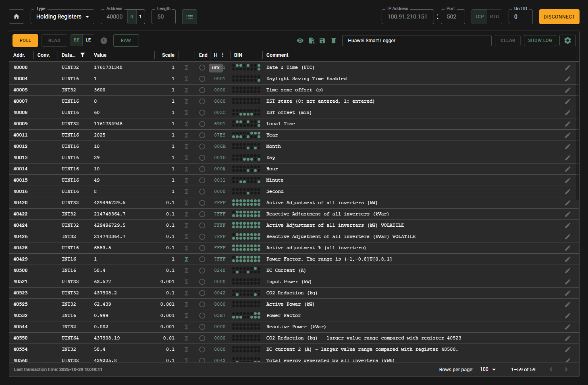

# Modbux

> by [ploxc](https://github.com/ploxc)


[](https://github.com/ploxc/modbux/releases)
[](https://github.com/ploxc/modbux/releases)
[](LICENSE)

[](https://ko-fi.com/ploxc)

## An Open Source Modbus Client & Server Simulation Tool for Windows, macOS and Linux

**Modbux is the tool I desperately needed four years ago.** It handles Modbus TCP, RTU and RTU over TCP, lets you assign datatypes to registers, scan for addresses and data, simulate servers for testing, and actually _understand_ what you're reading, all in one app.

## Download

**[Download the latest release](https://ploxc.com/modbux)**

Installers for Windows and macOS. Linux is supported and [builds from source](#build-it-yourself).

**[Read the documentation](https://ploxc.com/modbux/docs/latest/getting-started)**

## Features

**Client Mode:**

- Read/write every common data type: int16/32/64, uint16/32/64, float, double, bitmap, timestamps and UTF-8 strings
- Bitmap detail panel: expandable 16-bit view with per-bit toggles, color coding, invert, and inline comments
- Advanced mode: see all numeric data type interpretations simultaneously
- `Read configuration` mode: efficiently read only configured registers with automatic grouping, group index column, and inline error rows
- Scan Unit IDs and register ranges
- Big-endian / Little-endian support (swap registers)
- Scaling factors and linear interpolation
- Modbus TCP (with hostname/IP) and RTU support with automatic COM port discovery
- RTU over TCP for serial-to-Ethernet gateways that carry encapsulated RTU frames
- Configuration save/load (JSON)

**Server Mode:**

- Modbus TCP and RTU server modes (serial port, USB converters, socat virtual pairs)
- Simulate several Modbus devices at once (TCP mode)
- The full Unit ID range the protocol allows, 0-255, on every server
- The same data types as the client: numeric registers, bitmap, UTF-8 strings, Unix timestamps and IEC 870-5 datetime
- Static or random value generation with configurable intervals
- Time-based generators for Unix/datetime that output the current system time
- DateTimePicker with UTC toggle for setting exact timestamps
- Redesigned booleans: individual address rows with toggle circles, inline comments, and hover-to-delete
- Configuration save/load (JSON)
- Instant auto-start

**Split Mode:**

- Run client and server simultaneously in separate windows
- Server opens in a second window, main window becomes the client
- Connect to your own server via `127.0.0.1` for local testing
- Great for learning Modbus hands-on or developing both sides of a communication simultaneously

**State Persistence:**

- Everything saves automatically between sessions

## How It Compares

There are plenty of Modbus tools around and several of them are good at what they do. The
catch is that they each do one piece of it, and the good ones are paid and Windows-only:
a client here, a server there, a scanner separately. I used those for years, switching
between windows.

Modbux is free and open source, runs on Windows, macOS and Linux, and puts the client and
the server in one app, so you can point one at the other over `127.0.0.1` and test without
any hardware in front of you. The part I actually built it for is the interpretation:
every data type applied to the same registers at once, endianness you can flip, scaling,
and a scan that tells you where the data is instead of only which unit answered.

If you want it laid out tool by tool, there is a
[comparison page](https://ploxc.com/modbux/alternatives) on the site.

## UI



## Why This Exists

Four years ago, I was thrown into a CHP plant commissioning with zero Modbus experience. The client didn't know the addresses. I didn't know the protocol. I had a scanner that found... something... and a hex reader that showed me values I couldn't interpret.

_Is that temperature in register 100 or 101? Does the documentation start at 0 or 1? Why does TIA Portal call it 40000 when the manual says holding register 0? Is it big-endian or little-endian? Input registers or holding registers? Which function code do I even need?_

Oh, and it was Modbus RTU, so add "are my termination resistors right?" and "is my wiring actually correct?" to the list. Because if those aren't perfect, you're reading absolutely nothing and troubleshooting blind.

**This went on for four years.**

Gradually, I figured it out. But I watched colleague after colleague hit the same walls. We'd eventually succeed, sure, with blood, sweat, and way too many site visits. The tools we had could read a float or an int if you were lucky, but they never gave you the full picture. Endianness? Swap the registers yourself and hope. Documentation starting at the wrong offset? Good luck finding where the data actually lives.

Modbus TCP helped, at least the physical layer wasn't fighting you anymore. I built a TypeScript implementation for my home solar panels using [modbus-serial](https://www.npmjs.com/package/modbus-serial) (thanks [yaacov](https://github.com/yaacov)!), and things started clicking. The protocol itself actually made sense once you understood it.

Then came another commissioning. More problems. More frustration. And I snapped.

**"I've had enough of this."**

I dove into the protocol properly, really _understood_ it, and realized: I already have the pieces. I know how this works now. I can build the tool I've been wishing existed this entire time.

So I did.

I built something that shows you every possible data interpretation at once. That scans not just for devices, but for _where the actual data is_ (because I once spent hours discovering third-party documentation had the wrong register range). That lets you test PLC implementations against simulated devices _before_ you're on-site hoping everything works.

I use it every single day now. The idea of writing Modbus code and just _hoping_ it works when I connect to the real device? That's not how I work anymore.

**If you've ever fought with Modbus, you'll understand why this needed to exist.**

Built with Electron, React, and Material-UI. Open source because this industry needs better tools.

### Free, and Staying Free

No account, no trial, no paid tier. If Modbux saved you an afternoon on site, you can buy
me a [coffee](https://ko-fi.com/ploxc). The current goal is an Apple Developer certificate,
so macOS stops warning that the app is damaged on first launch.

## Why "Modbux"?

It's a typo I always made, _modbux_ instead of _modbus_. But it fits: it's your user experience (UX) working with Modbus. The typo became the brand.

## Pro Tip: Let AI Do the Boring Stuff

Saved configs are JSON. Show Claude or ChatGPT a few example registers, paste your device documentation, ask it to complete the mapping. Load it back into Modbux, done. Welcome to 2026.

## Installation

### Windows

Download the `.exe` file from releases.

⚠️ **SmartScreen warning**: Click "More info" → "Run anyway"

### macOS

Download the `.dmg` file from releases.

⚠️ **First time opening**: Right-click the app and select "Open"
(or go to System Preferences → Security & Privacy → "Open Anyway")

### Linux

No prebuilt package yet, but Linux is supported: `yarn build:linux` produces a `.deb` and an `.AppImage`. See [Build It Yourself](#build-it-yourself) for the steps, and the Linux notes there for unprivileged ports and serial port access.

## Build It Yourself

Modbux is an Electron application built with React, TypeScript, and Material-UI.

### Prerequisites

- Node.js (LTS version recommended)
- Yarn package manager

### Setup

**Clone and install dependencies:**

```bash
git clone https://github.com/ploxc/modbux.git
cd modbux
yarn
```

### Development

**Run the app in development mode:**

```bash
yarn dev
```

### Testing

**Run unit tests:**

```bash
yarn test
```

**Run unit tests in watch mode:**

```bash
yarn test:watch
```

**Run E2E tests:**

```bash
yarn test:e2e
```

**Run E2E tests against a packaged build:**

```bash
yarn test:e2e:packaged
```

This builds, packages with `electron-builder --dir`, and runs the same specs
against the binary in `dist/` instead of the `out/` bundle. It is the only way
to catch problems that exist solely in the packaged app — most importantly a
runtime dependency that sits in `devDependencies`, since only `dependencies` are
packed into `app.asar` while a normal run resolves everything from the repo's
`node_modules`.

Packaged runs use a throwaway user-data directory, so they never touch the
config of an installed Modbux.

On macOS and Linux the two socat specs run as well; on Windows they are skipped
because socat is unavailable, which is why a Windows run reports 36 skipped.

**Run the hardware E2E tests:**

```bash
yarn test:e2e:hardware
```

These are left out of the normal runs. They talk to an Arduino running
`tools/arduino/iem3000.ino` over a serial port and pause partway through so you
can pick the COM port, so they only make sense with the hardware in front of
you.

### Build

**Create a distributable package for your platform:**

```bash
# For Windows
yarn build:win

# For macOS
yarn build:mac

# For Linux
yarn build:linux
```

> **Linux notes:**
>
> The default Modbus port (502) requires elevated access. To allow binding without sudo:
>
> ```bash
> sudo sysctl net.ipv4.ip_unprivileged_port_start=502
> ```
>
> To persist across reboots:
>
> ```bash
> echo 'net.ipv4.ip_unprivileged_port_start=502' | sudo tee /etc/sysctl.d/50-unprivileged-ports.conf
> sudo sysctl --system
> ```
>
> For serial port access (RTU mode), add your user to the `dialout` group:
>
> ```bash
> sudo usermod -aG dialout $USER
> ```
>
> Log out and back in for it to take effect.

## Contributing

Found a bug? Have a feature request? **Please open an issue!** Modbux was born from real-world frustrations, and your feedback helps make it better for everyone in the industry.

Feel free to contribute—whether it's reporting issues, suggesting features, or submitting pull requests. See [CONTRIBUTING.md](CONTRIBUTING.md) for guidelines. Let's build the Modbus tool we all wish we'd had from day one.

## License

This project is licensed under the MIT License - see the [LICENSE](LICENSE) file for details.

## Third-Party Software

This software uses open-source packages with permissive licenses (MIT, ISC, Apache-2.0, BSD).
All third-party licenses are included in the distributed application.
